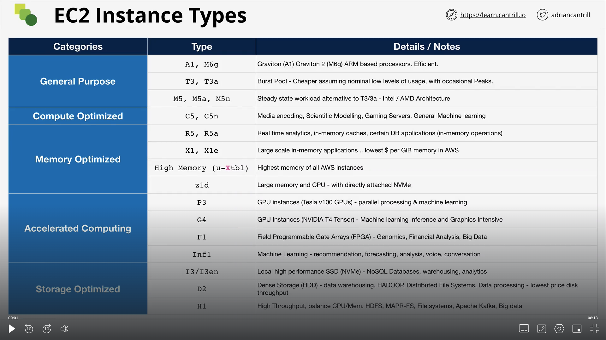

# Elastic Compute Cloud (EC2)

## Virutalization 101

### Without Virutalization

In a typical system, We have the physical hardware which can be the CPU or the Memory, the network cards or the storage devices. In any server, there is only one peice of software that can talk directly to the hardware and that is the operating system. The operating system, more specifically a part of the OS runs in priviledged mode called the **kernel** and only the kernel can access the hardware resources. If an application sitting on top of an OS wants to interact with hardware resources, it has go through the kernel.

### Emulated virtualization

Virtualization is a technique or a way to run multiple operating systems on a single peice of server. Each OS has its own set of applications. But the issue with this is that each unmodified OS has direct access to the hardware resources and having multiple OS running on a server caused system crashes. That is why, there was a concept of a host operating system/hypervisor which emulates memory, CPU, Network interfaces and storage for each OS (Virtual Machine Container). Each OS still believes that they have full access to the hardware and runs the operations in privileded mode but it is the Hypervisor that actually reads the instructions and runs it accordingly. This process of Guest OS trying to talk to Hypervisor was called Binary Translation.

**THIS WAS REALLY REALLY SLOW.**

### Para Virtualization

With Para Virtualization, the architecture was very similar to Emulated Virtualization. The key difference though was that the Guest OS were **_modified_** so that there priviledged mode operations can talk to the hypervisor instead of the hardware resources. Para Virtualization in short was hypervisor aware virtualization. It was still a software process.

### Hardware Assisted Virtualization

In this type of virtualization, the hardware is aware of virtualization. The guest OS makes the calls to the hardware and the hardware then calls the hypervisor and asks what needs to be done. Still in this kind of virtualization, the hardware resources are logical units and hence software is required for it to work correctly.

### SR-IOV

In this type, the hardware can also be divided based on the operatingn systems.

## EC2 Architecture and Resilience

EC2 instances are virtual machines, which mean they have an operating system and resources like storage CPU etc. They are run on top of EC2 hosts which is the physical hardware managed by AWS. We can have shared hosts or dedicated hosts (Dedicated hosts are more expensive). EC2 instances are AZ resilient, which means that if an AZ fails, then the instances fail. Lets try and understand the key points of the EC2 architecture:

1. EC2 instances run inside a specifc subnet of a VPC. This mean that instances are created inside one availability zone.
2. The EC2 host also is inside one AZ. There are many hosts inside an AZ. Each host has an instance store, which is temporary storage data, storage network and data network cards.
3. AWS attaches an elastic network card to an instance which points the EC2 host's physical network card.
4. We also have a long term storage service called EBS that can add volumes to an EC2 instance and they are also AZ specific.
5. If an EC2 instance is restarted, then it is attached to the same EC2 host. If the EC2 host is down for maintainence or if the instance is stopped and then started is when the EC2 host of an instance will change.

### What is EC2 Good for?

1. Traditional OS+Application Compute
2. Long-Running Compute
3. Server style applications
4. either burst or steady state load

**It is the default Compute Service for AWS.**

## EC2 Instance Types

EC2 instances can be of different types and each EC2 instance is different in terms of the following things:

1. Raw CPU, Memory and Network.
2. Resource Ratio: There are some instances that can be provisioined for compute heavy workloads and others for memory heavy workloads.
3. Data and Storage Network Bandwidth.
4. System Architecture like Intel or AMD.

### EC2 Categories

1. General Purpose - Default - Diverse Workloads, equal resource ratio.
2. Compute Optimized - Media Processing, HPC, Machine Learning etc.
3. Memory Optimized - Processing large in-memory datasets, some database workloads.
4. Accelerated Computing - Hardware GPU.
5. Storage Optimized - Sequential and Random IO. Data warehousing, Elastic Search.

### Decoding EC2 instance types

What does this even mean?

`R5dn.8xlarge`

R => Instance Family, 5 => Instance Generation, 8xlarge => Instance size, dn => Additional capabilites (Can be skipped in some instaces)

C: Compute
R: RAM (Mmeory)
I: IO
D: Dense Storage
G: GPU
P: Parallel Processing

https://instances.vantage.sh/

EC2 instance connect also requires the correct security rules to work.

https://ip-ranges.amazonaws.com/ip-ranges.json => This links helps in knowingn the IP addresses of the instance connect instances.

## Elastic Block Store (EBS)

### Key Terms

- Direct attached storage -> Storage on the EC2 Host
- Network attached Storage -> Volumes/Storage is delivered over the network
- Ephemeral Storage -> Temporary Storage
- Persistent Storage -> Permanent Storages that surpasses the life of an EC2 instance

### Categories of Storage

1. Block Storage - Volume presented to the OS as a collection of blocks without any structure. The OS can mount this to create a file system. In AWS, this can be physical hard drives or a volume sent over the network. Block Storage is mountable and bootable.

2. File Storage - Presented as a file share. It has structure and can be mounted to the OS. It is not bootable. It is mountable. Amazon EFS is a file storage.

3. Object Storage - Presented as a collection of objects. It is not mountable. It is not bootable. Amazon S3 is an object storage. Super scality is an object storage.

### Storage Performance

- IO (Block Size): Size of the blocks of data we are writing to the storage. 16K, 64K, 1M etc.
- IOPS: Number of operations per second that the storage can perform. 3000, 12000 etc.
- Throughput: The rate of data that can be transferred per second.

Throughput = IO \* IOPS

### EBS Architecture

EBS uses Block Storage as the storage system. This storage can be encrypted using KMS. EBS is an AZ resilient service. Different size, storage type and performance based volumes can be created in EBS. They can be detached and attached to different instances and do not depend on the instance lifecycle. We can create snapshots and store it in S3 and then create a volume from that snapshot. We are billed on GB per month.

### EBS Volume Types

- General Purpose SSD (GP2):
