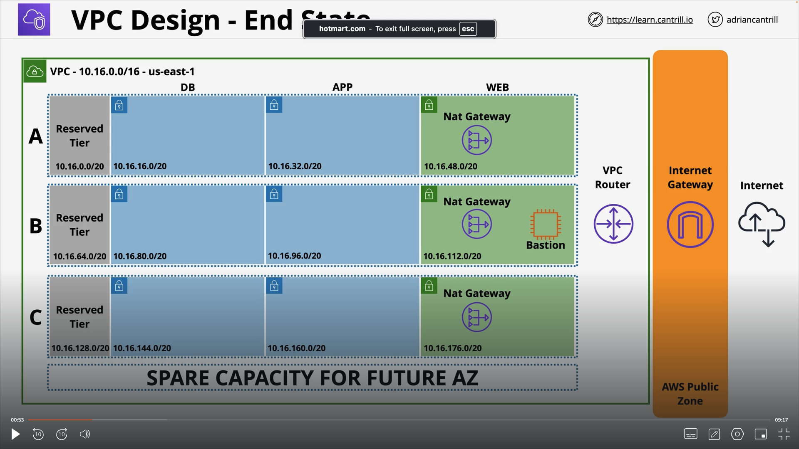
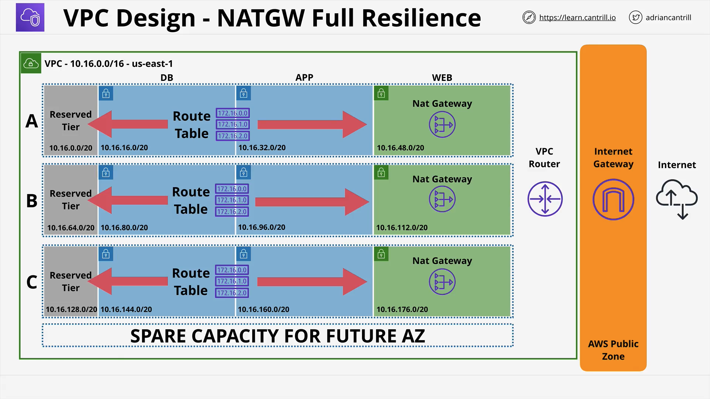

# Virtual Private Cloud

Virtual Private Cloud or a VPC is a private network inside your AWS account. Architecting a VPC is very important. In VPC diagrams, blue means a private subnet and green means a public subnet.

## VPC Considerations and Design

- What size should a VPC be? How many things can be a part of the VPC?
- Are there any networks we can't use?
- VPC minimum is /28 (16 IPs), maximum /16 (65536 IPs)
- Avoid Common ranges
- VPC Services run from within a subnet and not the VPC itself.

Lets try and break this down into step by step questions that we will ask:

- What are the IP ranges to avoid: We can ask the business team and see the network space of any existing on premise networks.
- Reserve 2+ Networks per region being used per account. For example, suppose we have 3 regiosn in US, 1 in Europe and Austrlia and 4 accounts then we will have 40 IP ranges setup.

- How many subnets will you need?
- How many IPs total? How many per subnet?

## VPC Design End State

## Custom VPCs

- Regional Service - All AZs in the region
- Isolated Network
- Nothing goes in or out without explicit configuration
- Flexible configuration - simple or multi tier
- Hybride Networking is possible (Combination of On Premise and VPC)
- Default or Dedicated Tenancy (Pricing is different. Needs to be selected very carefully)
- IPv4 Private CIDR Blocks and Public IPs
- Each VPC has one primary private IPv4 CIDR Block. It can be min /28 and max /16.
- We can also assign a IPv6 /56 CIDR Block
- DNS is Provided by R53 and its their in VPC `Base IP + 2` address.
- There are two configurations that can be set:
  1. enableDnsHostnames: This is used to give DNS hostnames to public IPs in a VPC.
  2. enableDnsSupport: Enables DNS Resolution in VPC.

## VPC Subnets

- VPC Subnets are parts of the VPC networks that are created in a particular availability zone. This makes VPC Subnets AZ resilient.
- One Subnet can be a part of ONLY one AZ. But one AZ can have multiple subnets.
- Each Subnet is provided with an IPv4 CIDR block. Optionally if the VPC has an IPv6 CIDR block, then the subnet can be given the same.
- Each CIDR block has to be non overlapping in a specific VPC.
- Inside a VPC, each subnet can connect to each other.
- There are 5 IP Addresses withing a VPC Subnet that we cannot use:
  1. Network Address: The starting address.
  2. Network + 1: VPC Router
  3. Network + 2: Reserved (DNS\*)
  4. Network + 3: Reserved for Future Use
  5. Broadcast Address: Last IP in the subnet.

We can also set auto assign Public IPv4 and IPv6 addresses. We manually created all these subnets in our accounts. The better way to do it is to automate the process.

## VPC Routing, Internet Gateway and Bastion Hosts

### VPC Router

Every VPC has a Router which is highly available. In every subnet, network+1 address is used by the router. It helps us to route traffic between subnets. Each router is controlled by the route table, which can be defined at the subnet level or by default a main route table is created for a VPC. **Route table controls what happens to the data as it LEAVES the subnet.**

Priority in the route table are:

1. Local Routes always take priority.
2. Route Table is associated to zero or more subnets. A subnet needs to have a route table, either specific or main route table.
3. Higher specific CIDR block.

### Internet Gateway

Internet Gateway is a regionally resilient gateway attached to a specific VPC. There can 1 VPC per 1 Gateway. It runs from withing the AWS Public Zone and Internet Gateway is used to connect to the public internet.

How to use an IGW:

1. Create IGW.
2. Attach IGW to VPC.
3. Create a Custom RT.
4. Associate RT.
5. Default Routes => IGW
6. Subnet allocate IPv4

The way IPv4 addresses work with an Internet Gateway is that when we attach a public IP address to say an EC2 instance, the IP address actually is not attached per say, instead the internet gateway maintains a map of the Private and the Public IP address. IGW changes the packets source and destinations based on these mappings. The EC2 instance's OS is never aware of the public IP address. In case of IPv6 addresses, IGW does not change the packet and just lets the packets pass through.

### Bastion Hosts

An instance in a public subnet. Incoming management connections arrive there and this is the only way to access internal VPC resources. **_They should not be used._**

When we say that we create a public subnet, what that means is that we can launch services inside the subnet that can have a public IP address attached to it.

## Stateful vs Stateless Firewalls

As we know TCP is a layer 4 protocol that sits on top of the layer 3 IP systems. Usually the server and client form a connection using request response structure. We also need to understand that outbound and inbound is from the perspective of the hardware. Firewalls are configured at the boundary level of a VPC.

### Stateless Firewalls

Stateless Firewalls treats request and response as two different things: One is an inbound rule and other is an outbound rule. In Stateless Firewalls we need to add 2 rules to control servers.

### Stateful Firewalls

A Stateful Firewall is intelligent enough to identify the request and response from a client or a server to be related. Since the ports and IPs are same. With stateful firewalls you only have to allow a request (Inbound or Outbound) and the server automatically knows.

## Network Access Control Lists (NACLs)

- NACLs are associated with one subnet and not the entire VPC.
- They are stateless and control either inbound or ourbound rules of a specific subnet. We can define explicit ALLOWS and explict DENY.
- Rules are defined based on order of the rule number.
- Since NACLs are stateless, we need the rule pair for inbound and outbound traffic which at scale becomes really tough to manage.
- In NACLs we can define rules only based on IP, CIDR Blocks and Ports.
- They are usually used with security groups to add explicit denies.

## Security Groups

Security groups are another way to sceure our VPC.

- Unlike NACLs they are stateful and can detect response or request. Allowed IN or OUT request means ALLOWED response.
- We can add ALLOWs and there is always an implicit deny.
- We cannot explicitly DENY. We cannot deny bad actors.
- They also support referencing AWS logical resources which is really nice.
- SG are attached to Network Interfaces!
- We can add logical resources like security groups inside a SG rule. For example suppose, we have a web EC2 instance running in a subnet and app EC2 instance running in another subnet. We can allow the SG of the web to be able to access that of the app.
- We can also do self referencing.

## NAT Gateway (Network Address Translation)

- NAT essentially are a set of processes that helps in remapping the src or destionation of an IP Packet.
- Gives Private CIDR range **_outgoing_** internet access.
- The Job of a NAT gateway is to masquerade the Private IP addresses that want to ask for data from a public IP address. Its a many to one translation.
- NAT Gateways need to run from a public subnet.
- It uses Elsatic IPs (Static IPv4 Public)
- AZ Resilient Service (HA in that AZ). For region resilience, NATGW in each AZ is required.
- DO not work with IPv6.

## Final Design to remember

