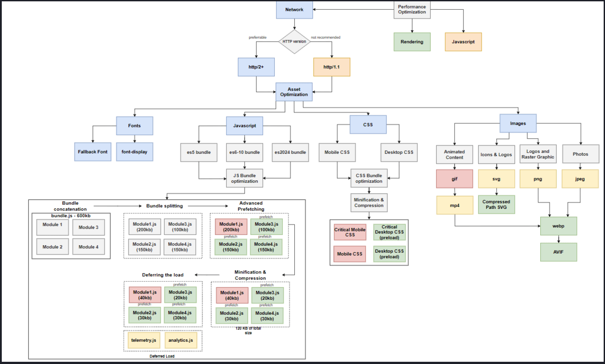

# Frontend System Design

This document helps us understand how we can design scalable frontend applications.

## Core Fundamentals

### Box Model

Every element in the DOM is a box. The box model consists of several layers:

1. Content Box: This is the content of the element. It is the area that contains the text, images, etc.
2. Padding Box: This is the space between the content and the border. It is the area that is not visible.
3. Border Box: This is the border of the element. It is the area that is visible.
4. Margin Box: This is the space between the border and the next element. It is the area that is not visible.

There are 2 types of box properties:

1. Box Size
   - Intrinsic: The natural size of the element. Depends on the content.
   - Restricted: The size of the element after applying CSS properties. Constrained by the parent element.
2. Box Type:
   - Block: The element is a block-level element. It takes up the full width of its parent. Height is controlled by the content. The element is rendered from top to bottom.
   - Inline: They render as a string and they flow from left to right. They do not respect width, height, vertical margins etc.
   - Inline-Block: We can control the width and height.

A formatting context is a rendering area that is governed by its own set of rules. They key ideas of a formatting context are:

1. Isolation: Elements within a context are shielded from the rules of the outside context.
2. Scalability: A new ruleset for elements is as simple as creating a new Context.
3. Predictability.

### Browser Positioning System

The normal flow is from top to bottom and left to right. The position attribute is used to break the normal flow and position the element based on how we want it to.

1. Static: Default.
2. Relative: The element is positioned according to the normal flow of the document. **_The offset (top, left, bottom, right) applied is relative to itself._**. We create a new stacking context.
3. Absolute: To understand position absolute, we need to understand what a containing block is. Containing block is the nearest positioned ancestor. The element is removed from the normal flow. **_The offset (top, left, bottom, right) applied is relative to the containing block._**

Whenever we do position absolute, or 3D transformations, we activate additional axis called the Stacking Context.

### Reflow

The way that the browser works is that it takes the HTML and CSS and creates DOM and CSSOM. With these 2 it creates a render tree. The render tree is given as an input to reflow which first:

1. Runs JS.
2. Recaculates the styles.
3. Recalculates the Layout.
4. Paint (This is where the GPU is used)

If we trigger reflow again, it can block the main thread. We can optimise the reflow pipeline to reduce the CPU load and unblock the main thread.

### Composition Layers

Old browsers only used CPU to paint. But new browsers use GPU to paint. To make the HTML elements GPU aware, instead of a DOM tree a Render Object Tree is created. Post this we have a Render Layer. Its constructed when we set position as relative or absolute, or when it isn transparent. With the Render Object Tree the Render Layer tree is created. After that a Graphics Layer Tree is created. It has all the animations.

DOM Tree => Render Object Tree => Render Layer Tree => Graphics Layer Tree

Anytime we utilise the Graphic Layer. It utilises the browser resources. We need to utilise the graphic layer with a purpose.

https://csstriggers.com/

## DOM API

DOM API are a set of APIs that can be used to manipulate the DOM. Let us first understand the Global objects that are avilable to use: Window: Global object for the browser, Document: Represents the HTML document.

The class Hiercharchy is:

HTMLElement => Element => Node

### DOM Querying

1. **getElementById**: The browser creates a hashmap of id to element. That is why this is the fastest way to query the DOM. It returns an Element.
2. **getElementsByClassName** and **getElementByTagName**: The browser actually traverses the whole tree. It uses DFS to find the elements. It returns a live collection of elements.
3. **querySelector**: The browser finds the elements using the CSS selector. It returns an element.
4. **querySelectorAll**: The browser finds the elements using the CSS selector. It returns NodeList.

Whenever we see the keyword Collection, it means a reference of the original object.

**_DOM Performance Best Practices_**

1. Simplify the Selectors.
2. Use IDs for the core container.
3. Pick the Right Start point.

Adding new Elements is always expensive.

### Intersection Observer API

The Observer APIs were created to help developers with common challenges. Intersection Observer API is one of them. Intersection Observer takes 2 arguments:

1. The target element: The element that needs to be tracked.
2. Config:
   - root: The element that the target is relative to.
   - threshold: The percentage of the target that needs to be visible.
   - callback: The callback function that is called when the target is intersecting with the root.

We can use `DocumentFragment` to create a Virtual DOM tree. The advantage of a DocumentFragment is that it is not part of the DOM tree. It is not visible and does not trigger reflow or repaint.

### Mutation Observer API

Mutation Observer API is another observer API. It is used to observe changes to the DOM. Usually used with Rich Text Editors.

The observer needs to be setup correctly, to avoid memory leaks.

### Resize Observer API

There are multiple ways to track resizing of elements.

1. resize event: Fires whenever window size changes. Do not use this.
2. CSS Media Queries.
3. CSS Container Queries.
4. Resize Observer API.

```javascript
const observer = new ResizeObserver((entries) => {
  for (let entry of entries) {
    console.log(entry.contentRect);
  }
});

observer.observe(document.querySelector("div"));
```

## Virtualization

Virtualization is a UI optimization technique that involves maintaining a data in memory while rendering only a limited subset.

[Refer to this code to see how Virtualization can be implemented](https://github.com/awesome31/learning-curve/tree/main/modules/frontend-system-design/virtualization)

## Application State and Networking

### Application State Design

Data that we store has two things:

1. UI State: App Config, UI Element State or Server Data.
2. Data Properties: Access Level, Read/Write Frequency, Size.

There are some general principles:

1. Minimize Access Cost: This can be done using data normalization. Optimise the data structure.

```
   {
      id: 1,
      name: Rohit,
      job: {
         id: UIE,
         title: UI Engineer,
         department: Engineering
      }
   }

   The above object can be converted to 1NF.

   {
      id: 1,
      name: Rohit,
      job_id: UIE,
      job_title: UI Engineer,
      job_department: Engineering
   }
```

2. Minimize Search Cost: Inverted Index Tables. Basically a substring map can be created.
3. Minimize RAM Usage: Global State to have only the data that we want.

There are 3 types of databases that we have:

1. Indexed DB: Does not block thread and is unlimited storage. All types of data can be stored.
2. Local Storage: Limited to 5MB. Only string data can be stored.
3. Session Storage: Limited to 5MB. Only string data can be stored.

### Network Connectivity

We have 2 main protocols: UDP and TCP. UDP is connectionless and TCP is connection oriented. UDP ensures speed while TCP ensures reliability. HTTP1/2 depend on TCP.

HTTP/3 is a new protocol that is based on QUIC. UDP is used for QUIC. Web RTC also uses UDP. There are few ways to design network architecture:

1. Long Polling: We keep making a request to the server and wait for a response. It has a few issues like: Energy Consumption, Latency. Usually Long Polling should be avoided for a mobile web application.
2. Server Sent Events: Duplex communication is only used when establishing initial connection. Reconnection is handled automatically. text/event-stream needs to be used for SSE. Check [this](https://github.com/awesome31/learning-curve/tree/main/modules/frontend-system-design/sse) for more details.
3. WebSockets: Duplex communication is used for all the time. First the client sends a handshake request with UPGRADE header. WebSockets are very resource consuming.

## Web Application Performance

1. We can do Network Optimisation by using HTTP2/3. HTTP2 supports multiplexing, provides better header compression.
2. We can do JS Bundle Optimisation. Based on the user agent of the client, we can serve different bundles. We can also do code splitting.
3. CSS Optimisations
   - We can bundle CSS files to reduce the number of requests.
   - Critical Style Extraction: We can extract the critical CSS and inline it in the HTML.


