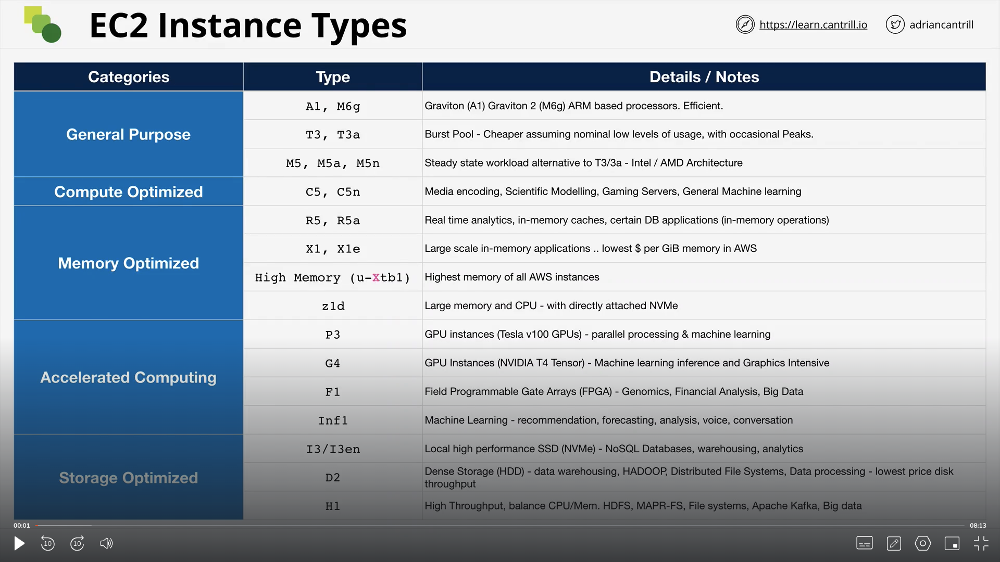

# Elastic Compute Cloud (EC2)

## Virutalization 101

### Without Virutalization

In a typical system, We have the physical hardware which can be the CPU or the Memory, the network cards or the storage devices. In any server, there is only one peice of software that can talk directly to the hardware and that is the operating system. The operating system, more specifically a part of the OS runs in priviledged mode called the **kernel** and only the kernel can access the hardware resources. If an application sitting on top of an OS wants to interact with hardware resources, it has go through the kernel.

### Emulated virtualization

Virtualization is a technique or a way to run multiple operating systems on a single peice of server. Each OS has its own set of applications. But the issue with this is that each unmodified OS has direct access to the hardware resources and having multiple OS running on a server caused system crashes. That is why, there was a concept of a host operating system/hypervisor which emulates memory, CPU, Network interfaces and storage for each OS (Virtual Machine Container). Each OS still believes that they have full access to the hardware and runs the operations in privileded mode but it is the Hypervisor that actually reads the instructions and runs it accordingly. This process of Guest OS trying to talk to Hypervisor was called Binary Translation.

**THIS WAS REALLY REALLY SLOW.**

### Para Virtualization

With Para Virtualization, the architecture was very similar to Emulated Virtualization. The key difference though was that the Guest OS were **_modified_** so that there priviledged mode operations can talk to the hypervisor instead of the hardware resources. Para Virtualization in short was hypervisor aware virtualization. It was still a software process.

### Hardware Assisted Virtualization

In this type of virtualization, the hardware is aware of virtualization. The guest OS makes the calls to the hardware and the hardware then calls the hypervisor and asks what needs to be done. Still in this kind of virtualization, the hardware resources are logical units and hence software is required for it to work correctly.

### SR-IOV

In this type, the hardware can also be divided based on the operatingn systems.

## EC2 Architecture and Resilience

- EC2 instances are virtual machines. (OS + Resources). They run on an EC2 host. An EC2 host is launched in a specific AZ, meaning that EC2 is a AZ resilient service. EC2 hosts can be shared or dedicated.

- EC2 instances run on one specific Availability Zone (AZ). Each EC2 host has some CPU and Memory, and alongside that we have a temporary storage called the instance store on a host and we have 2 types of network cards, storage network and data network. An EC2 instance is launched in a specific subnet of an AZ. Instances cannot move between AZs. Everything about an EC2 instance is specific to one AZ.

- Instances can utilize the network storage service of AWS called Elastic Block Store (EBS). EBS is also an AZ service. The EC2 host on which an instance is running depends on the type of instance that is provisioned.

### What is EC2 good for?

1. Traditional OS+Application Compute
2. Long-Running Compute needs
3. Server Style applications
4. Either burst or steady-state load
5. Monolithic application stacks

## EC2 Instance Types

The choice of an EC2 instance type influences a lot of things:

1. Raw Memory, CPU, Local Storage.
2. The storage and data network bandwidth.
3. Resource Ratios: If it is Compute optimized, then the ratio of memory to CPU is high. If it is Memory optimized, then the ratio of memory to CPU is low.
4. System Architecture and Additional Features.

There are different categories of EC2 instance types:

- General Purpose: Default - Diverse Workloads, equal resource ratio.
- Compute Optimized: High CPU to Memory ratio.
- Memory Optimized: High Memory to CPU ratio.
- Storage Optimized: High Storage to CPU ratio.
- Accelerated Computing: High GPU to CPU ratio.

### Decoding EC2 Types

The names of the EC2 types can be very confusing and hence it is important to understand how to decode it.

```
R5dn.8xlarge

R: Instance Family
5: Instance Generation
8xlarge: Instance Size
d/n: These are additional capabilities
```

### List of popular instances

1. https://aws.amazon.com/ec2/instance-types/
2. https://instances.vantage.sh/



### Things to remember about EC2 Instances Connection

1. Make sure that the IP address is allowed in the security group of the EC2 instance.
2. The IP address of the EC2 instance connect servers can be found here: https://ip-ranges.amazonaws.com/ip-ranges.json

## Storage Refresher

Let us talk about some key terms:

1. Direct Attach Storage: Storage directly attached on the EC2 Host
2. Network attached Storage: Storage attached over the network (EBS)
3. Ephemeral Storage: Temporary Storage
4. Persistent Storage: Lives on past the lifetime of the instance
5. Block Storage: Volume presented to the OS as a collection of blocks, no struture provided. Mountable and Bootable.
6. File Storage: Provided by a file server. There is a structure of a file system already there. Mountable, not bootable.
7. Object Storage: Collection of objects, flat. Not mountable or bootable.

Now that the key terms are in place, let us talk about the storage performance:

1. IO Block Size: Size of the wheels
2. IOPS: RPM of the wheel
3. Throughput: Amount of data that can transferred per second. (Speed of the car :p)

Its not true that if we increase the IO Block size then we can increase the performance. It all depends on the hardware.

## EBS Service Architecture

EBS is a service that provides block storage. Instances see the block storage and can use to create a file system. (ext3/4, xfs, etc). Storage is provisioned in one AZ and is attached to one EC2 instance over a storage network. They can be detached and reattached to other storage networks as well. We can create snapshots and put it in S3, which makes the EBS service regionally resilient. We can provision storage of different types, size and performance profile. We are billed using GB/month metric.

## EBS Volume Types

There are different EBS Volume types, each with different performance profile and price.

### General Purpose

There are two types of general puprose EBS volumes: gp2 and gp3. gp2 volume can be as small as 1GB and as big as 16TB. The architecture of any volume is that there is an IO bucket, which when empty disallows users from doing any operation on the volume. It fills at the baseline peformance rate. The rate at which the bucket fills depends on the size of the volume (3 IO credits per second per GB). GP2 can burst upto 3000 IOPS.
